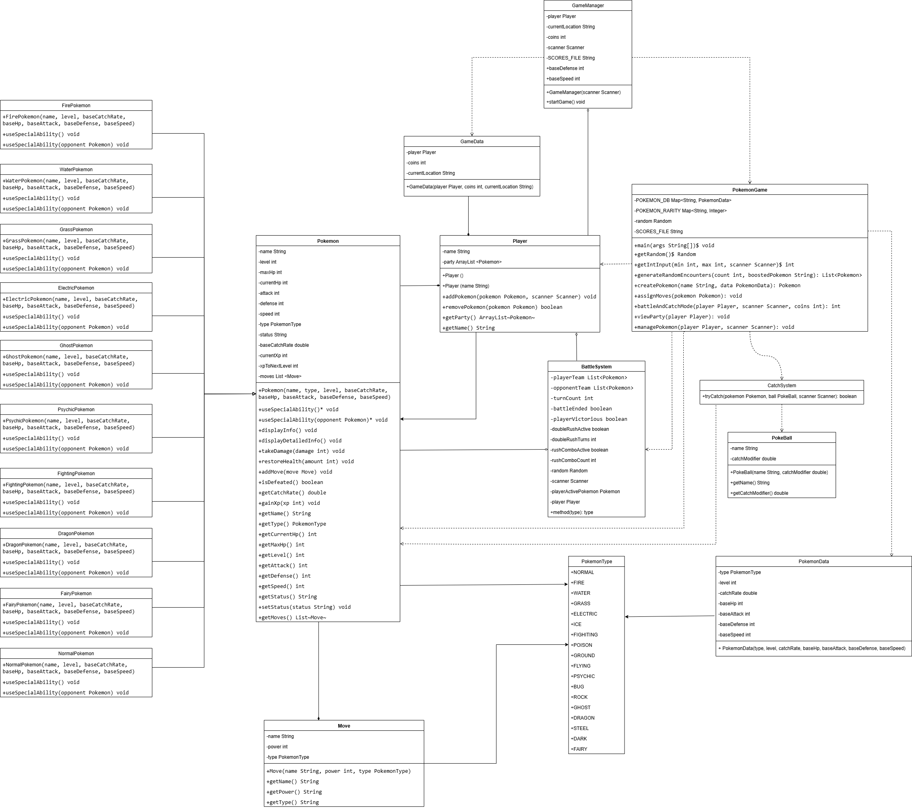

# Pokémon GA Ole

Welcome to the **Pokémon GA Ole** project!  
This repository contains code and resources for a project that explores Pokémon data, likely with features such as data analysis, visualization, or gameplay simulation.  
Feel free to use, modify, and contribute to this project.

## Table of Contents

- [Features](#features)
- [Installation](#installation)
- [Usage](#usage)
- [Project Structure](#project-structure)
- [Contributing](#contributing)

- [Pokémon Ga Ole Demo](https://youtu.be/rWL1y9Yw2tk)



## Features

### 1. Simulate "Disc Dispensing" / Gacha System
- **Concept**: Mimics Ga-Ole's real disc dispensing by letting players spend coins for a random new Pokémon or move.
- **Implementation**:
  - Adds a "Disc Machine" or "Get New Pokémon" option to the main menu.
  - Coins are deducted when used.
  - Random Pokémon (with rarity weighting) is added to the party from `POKEMON_DB`.
  - Displays a message: “A new disc appeared! You got [Pokemon Name]!”

### 2. Enhanced "Rush" System
- **Concept**: Builds on the existing "Double Rush" and "Rush Combo" with interactive quick time events (QTEs).
- **Implementation**:
  - When Rush activates, prompts the user for rapid input (e.g., “Press 'A' 5 times quickly!”).
  - QTE success determines the rush bonus (damage multiplier/duration).
  - Adds ASCII art and visual feedback (e.g., `⚡⚡⚡ RUSH! ⚡⚡⚡`).

### 3. Interactive "Get Chance" / Catching Mini-Game
- **Concept**: Makes catching Pokémon an interactive mini-game like in Ga-Ole.
- **Implementation**:
  - Replaces simple probability with a timing or input-sequence mini-game (e.g., “Press Enter when the bar is in the green zone!”).
  - Mini-game success modifies catch rates.

### 4. Trainer Support Skills/Items
- **Concept**: Trainers can use support items or skills during battle.
- **Implementation**:
  - Adds a "Trainer Skill" option during battle.
  - Example skills: Heal Party, Boost Attack, Confuse Opponent.
  - Skills have cooldowns or limited uses per battle.

### 5. More Dynamic Battle Output
- **Concept**: Makes the CLI battle more engaging and visually clear.
- **Implementation**:
  - Clear turn indicators with prominent headers.
  - Text-based attack animations (e.g., “[Attacker] charges... BOOM! [Defender] took damage!”).
  - More descriptive status effect messages.
  - ASCII HP bars (e.g., `[████████--]`).

### 6. Pokémon Growth/Evolution (Post-Battle)
- **Concept**: Pokémon grow stronger and can evolve after battles.
- **Implementation**:
  - Victorious Pokémon earn experience points (XP).
  - Pokémon level up and increase stats at XP thresholds.
  - Evolution mechanics if a Pokémon reaches a required level.

### 7. User Selection: Start as New or Existing User
- **Concept**: Allows players to either start as a new user or continue as an existing user based on saved data.
- **Implementation**:
  - On game start, provides an option to select a new user profile or load an existing one from saved user data.
  - Supports multiple user profiles for different progress and records.
  - Enhances replayability and makes it easier to manage multiple playthroughs.

### 8. View Top Scores
- `saveScore()` now stores both player's name and score.
- `displayTopScores()` shows a formatted leaderboard with names and scores.

### 9. Save Game Improvements
- `saveGame()` now include thematic messages, simulating the experience of using a "Trainer Card" or "Disc", making the save/load process more immersive and thematic for players.

---

These features aim to bring the Pokémon Ga-Ole experience to life in the CLI, capturing both the game’s excitement and its unique mechanics!

## Installation

1. **Clone the repository:**
   ```bash
   git clone https://github.com/Qiyou0103/pokemon-ga-ole.git
   cd pokemon-ga-ole
   ```

## Project Structure

```
pokemon-ga-ole/
├── src/         # Source code
├── data/        # Data files
├── tests/       # Test cases
└──  README.md
      
```

## Contributing

Contributions are welcome!  
Please open issues or submit pull requests for improvements and bug fixes.

